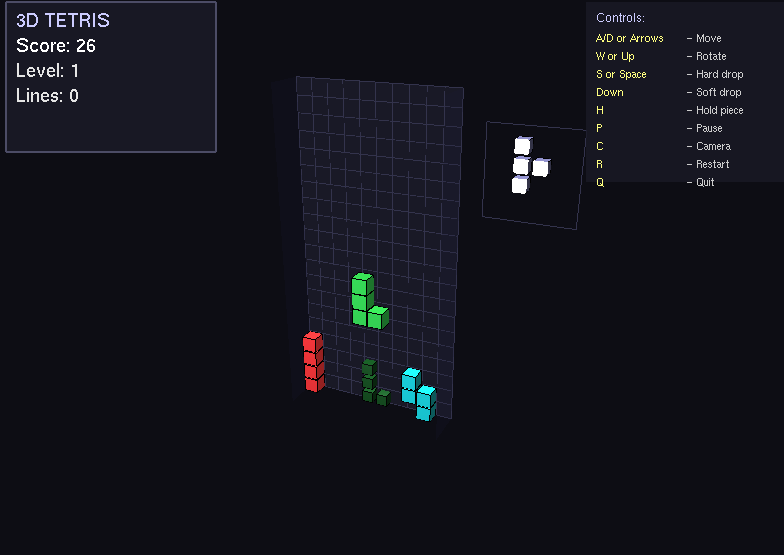
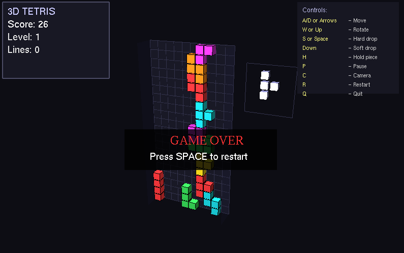

# 🧩 3D Tetris (PyOpenGL)

A feature-rich, interactive 3D Tetris game built in Python using **PyOpenGL**, **FreeGLUT**, and **NumPy**. This project brings classic Tetris mechanics into a modern 3D space with real-time lighting, smooth animations, wall-kicks, ghost projections, camera controls, and an on-screen HUD.

---

## 📸 Screenshots

| Gameplay View | Hold & Next Preview |
| :---: | :---: |
|  |  |

---

## ✨ Features

* **3D Visuals & Dynamic Lighting:** 
  * Custom 3D cube rendering with ambient, diffuse, and specular light properties (`GL_LIGHT0` & `GL_LIGHT1`).
  * Wireframe overlays for high block visibility and retro aesthetic.
* **Classic Tetris Mechanics:**
  * **Wall-Kicks:** Smart rotation handling using offset checks to allow rotation against boundaries.
  * **Ghost Piece:** Transparent projection showing exact land position.
  * **Hold Mechanic:** Swap and hold pieces on demand (`H` key).
  * **Next Piece Preview:** Dedicated 3D box showing the incoming piece.
  * **Soft & Hard Drops:** Soft drop (+1 pt/cell) and instant hard drop (+2 pts/cell).
* **Interactive 3D Camera:**
  * **Auto-Rotate Mode:** 360-degree continuous camera orbit around the playfield (`C` key).
  * **Manual Orbit:** Rotate camera manually using `K` and `L` keys for better viewing angles.
* **On-Screen HUD:** Built-in 2D overlay displaying live Score, Level, Lines Cleared, Game Status (Paused/Game Over), and Controls.

---

## 🎮 Controls

| Key / Input | Action |
| :--- | :--- |
| **`A`** / **`D`** or **`←`** / **`→`** | Move piece Left / Right |
| **`W`** or **`↑`** | Rotate piece (with wall-kick support) |
| **`↓`** | Soft drop (+1 score per cell) |
| **`S`** or **`Space`** | Hard drop (+2 score per cell) |
| **`H`** | Hold / Swap piece |
| **`K`** / **`L`** | Rotate camera manually (CCW / CW) |
| **`C`** | Toggle auto-rotating camera |
| **`P`** | Pause / Resume game |
| **`R`** | Restart game |
| **`Q`** or **`ESC`** | Quit game |

---

## 🚀 Getting Started

### Prerequisites

Ensure you have **Python 3.8+** installed on your system.

### Installation

1. **Clone the repository:**
```bash
git clone https://github.com/YOUR_USERNAME/3d-tetris-opengl.git
cd 3d-tetris-opengl
```

2. **Create a virtual environment (recommended):**

* **On Windows:**
```powershell
python -m venv .venv
.venv\Scripts\activate
```

* **On macOS / Linux:**
```bash
python3 -m venv .venv
source .venv/bin/activate
```

3. **Install required dependencies:**
```bash
pip install -r requirements.txt
```

---

## 🕹️ How to Run

Execute the main game script from your terminal:

```bash
python 3D_TETRIS_423_PROJECT.py
```

---

## 📁 Project Structure

```text
3d-tetris-opengl/
├── docs/                     # Folder for repository media
│   ├── screenshot1.png       # Gameplay screenshot
│   └── screenshot2.png       # Preview/HUD screenshot
├── 3D_TETRIS_423_PROJECT.py  # Main Python game script
├── requirements.txt          # Python library dependencies
├── .gitignore                # Files/folders ignored by Git
└── README.md                 # Project documentation
```

---

## 🛠️ Built With

* **[Python](https://www.python.org/)** - Core programming language.
* **[PyOpenGL](https://pyopengl.sourceforge.net/)** - OpenGL bindings for 3D graphics.
* **[FreeGLUT](https://freeglut.sourceforge.net/)** - Window management, context creation, and input handling.
* **[NumPy](https://numpy.org/)** - Efficient grid array and dynamic buffer management.
